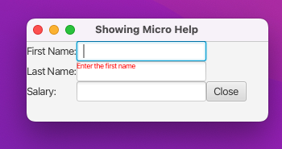
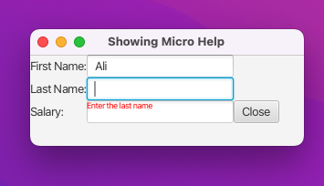

# JavaFX17 Book - Chap06 Branch - Nodes

This repo is structured to show code examples for chap02. Every example will have its own commit and associated screenshot with same title as the commit message. To view code for a GUI SS, open respective commit.

Practice Code Examples wrt every commit.
Chap02: Nodes in JavaFX Graph Scene Data Structure

#### Listing 6-7, tooltip using Un-managed Nodes for Micro Text Help

As all managed nodes, are laid out by their parent node. And the parent node needs to figure out their size and position. Therefore if we want to show a tooltip without disturbing the layout of the parent node, we use Un managed nodes, and specify the position and size for the node without bothering its parent.
As shown below the tool tip text in red for hints doesn't shift the text fields in the parent node.

