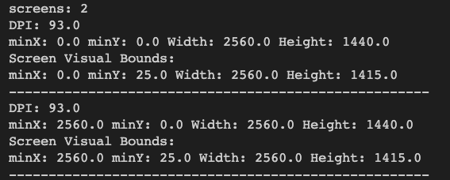
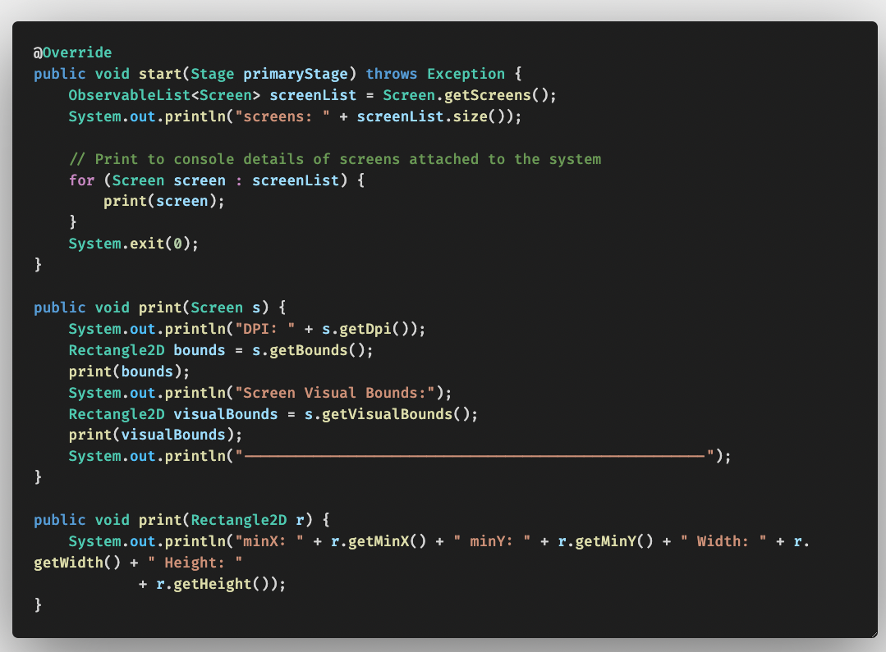

# JavaFX17 Book - Chap04 Branch

This repo is structured to show code examples for chap02. Every example will have its own commit and associated screenshot with same title as the commit message. To view code for a GUI SS, open respective commit.

Practice Code Examples wrt every commit.
Chap02: is about Property Bindings in JavaFX (Observable Pattern)

#### Listing 4-1, Accessing Details of Screen

Details of Screens printed to Console

Screen Class provides multiple Screen Details

