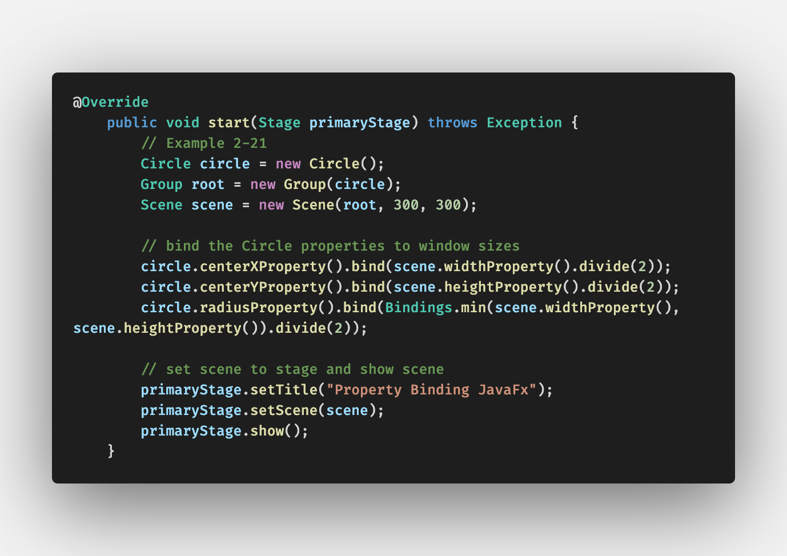
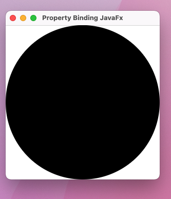
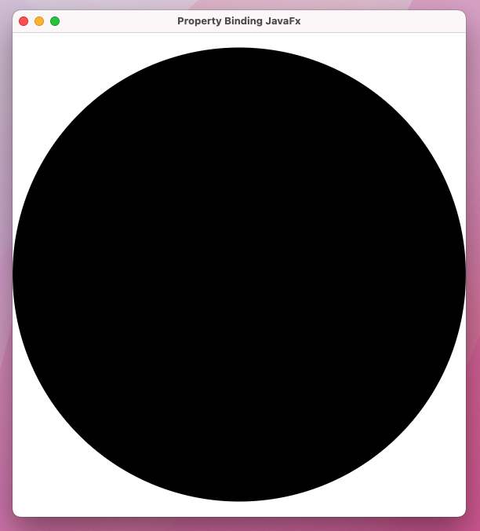

# JavaFX17 Book - Chap02 Branch

This repo is structured to show code examples for chap02. Every example will have its own commit and associated screenshot with same title as the commit message. To view code for a GUI SS, open respective commit.

Practice Code Examples wrt every commit.
Chap02: is about Property Bindings in JavaFX (Observable Pattern)

#### Listing 2-21, Property binding Using Circle Resizing with Window

Property binding for circle properties

This is the startup screenshot

This is after resizing the window

