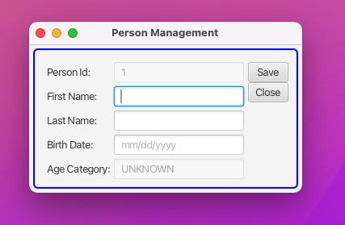
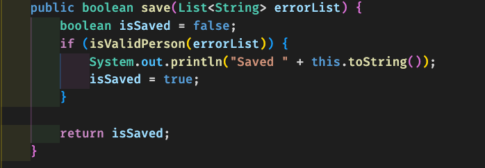
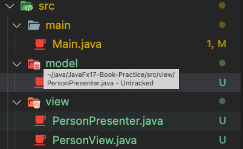

# JavaFX17 Book - Chap11 - MVC Example for a Sample JavaFX Project

Practice Code Examples wrt every commit.
This repo is structured to show code examples for chap11. Every example will have its own commit and associated screenshot with same title as the commit message. To view code for a GUI SS, open respective commit.
Chap11: MVC JavaFx Project Example

#### On Application start - Form state

#### Data Binding for Age Category

The age category auto updates as soon as the birth date field is entered. Auto binding of view with model.

#### On Save Method of Mode

Model onSave Method is currently just printing to the console but can be modified to write to file or DB

#### Save method of the model

#### MVC Project Structure in Java

